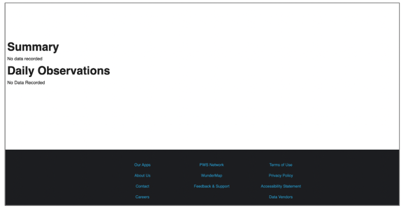
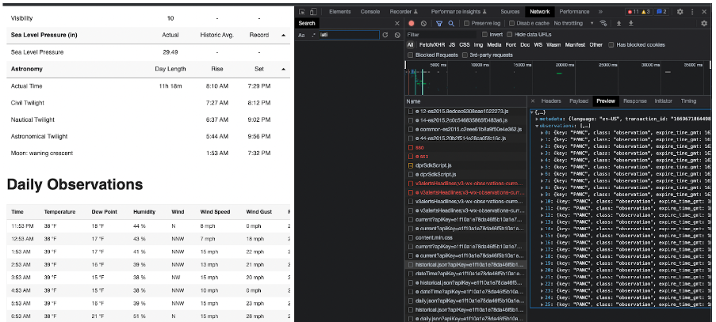

```python
import sys
import os
import time
sys.path.append("../")

if "data" not in os.listdir("."):
    os.chdir("../")
```


```python
import warnings
warnings.simplefilter(action='ignore', category=FutureWarning) # ignore FutureWarnings from pd
# import warnings

import datetime
import pickle
import logging
import pytz
import pandas as pd
import numpy as np
from sklearn.ensemble import RandomForestRegressor
from sklearn.linear_model import MultiTaskLassoCV
from sklearn.linear_model import Ridge
from sklearn.linear_model import Lasso
from sklearn.linear_model import LinearRegression
from sklearn.exceptions import ConvergenceWarning
warnings.simplefilter("ignore", category=ConvergenceWarning)

import urllib.request
import json
import requests
from math import ceil
# import multiprocessing
# from multiprocess.pool import Pool

from raw_data import wunderground_download
import predictor.utils as utils
from predictor.models.predictor_zeros import ZerosPredictor
from predictor.models.unique import ArimaPredictor
from predictor.models.unique import HistoricAveragePredictor
from predictor.models.seamus import BasicOLSPredictor
from predictor.models.seamus import LassoPredictor
from predictor.models.seamus import GBTPredictor
from predictor.models.vinod import PrevDayHistoricalPredictor
from predictor.models.vinod import MetaPredictor
from sklearn.multioutput import MultiOutputRegressor
from sklearn.ensemble import GradientBoostingRegressor
from predictor.models.predictor_scaffold import Predictor

# logging.basicConfig(level=logging.INFO)
```

# Weather Prediction
By Yash Patel, Vinod Raman, Seamus Somerstep, and Unique Subedi

## Introduction

In this project, we are tasked with predicting the minimum, average, and maximum temperatures for the next five days for 20 different weather stations. This report summarizes our data pipeline and the models we used to tackle this task.  We will first discuss the data collection and webscraping process as well as any pre-processing details on the data (including validation set up).  Next we will discuss the baseline models used including models based on historical averages and models based on the temperature of the previous day.  Finally, we discuss the variety of statistical models assesed and the performance on the validation set on each one.

## Data Sources and Preparation
To leverage the different strengths of publicly available datasets, we used NOAA and Wunderground as our data sources in the following manners:

- NOAA: used to acquire historical data going back to 1960
- Wunderground: used to acquired recent data, not restricted in timespan in theory but only used for the final year of analysis in the models presented

Acquiring data from NOAA was straightforward after doing a conversion of the airport codes to the codes in the NOAA database, using the code below. By default, results are saved into `data/raw_noaa`:


```python
station_code_to_noaa = {
    "PANC": "USW00026451",
    "KBOI": "USW00024131",
    "KORD": "USW00094846",
    "KDEN": "USW00003017",
    "KDTW": "USW00094847",
    "PHNL": "USW00022521",
    "KIAH": "USW00012960",
    "KMIA": "USW00012839",
    "KMIC": "USW00094960",
    "KOKC": "USW00013967",
    "KBNA": "USW00013897",
    "KJFK": "USW00094789",
    "KPHX": "USW00023183",
    "KPWM": "USW00014764",
    "KPDX": "USW00024229",
    "KSLC": "USW00024127",
    "KSAN": "USW00023188",
    "KSFO": "USW00023234",
    "KSEA": "USW00024233",
    "KDCA": "USW00013743",
}

base_url = "https://www.ncei.noaa.gov/pub/data/ghcn/daily/all/"

os.makedirs(utils.raw_noaa_cache, exist_ok=True)
for station_code in station_code_to_noaa:
    url = f"{base_url}/{station_code_to_noaa[station_code]}.dly"
    urllib.request.urlretrieve(url, os.path.join(utils.raw_noaa_cache, f"{station_code}.dly"))
    logging.info(f"Scraped data for: {station_code}")
```

We simply had to parse the DLY files acquired from the NOAA database, which could easily be done as follows. By default, results are saved into `data/processed_noaa`:


```python
from data.process_noaa import read_noaa_data_file

def process_noaa(station):
    noaa_path = os.path.join(utils.raw_noaa_cache, f"{station}.dly")
    noaa_data = read_noaa_data_file(noaa_path)

    os.makedirs(utils.processed_noaa_cache, exist_ok=True)
    noaa_out_path = os.path.join(utils.processed_noaa_cache, f"{station}.csv")
    noaa_data.to_csv(noaa_out_path)

for station in utils.stations:
    process_noaa(station)
    logging.info(f"Processed data for: {station}")
```

Acquisition from Wunderground, however, was complicated by several issues. These, however, were worth navigating, since Wunderground was ultimately used as the ground truth data source in the final evaluation. The source of the complication was that Wunderground fetches its content dynamically, making a naive web scraper useless to get the data, as seen initially in loading a Wunderground page:



To circumvent this, we found the resources that were being fetched by the page by looking at the resources through Google Chrome's network analysis:



From this, we were able to find that the contents of the hourly data, shown at the bottom of the Wunderground page, is fetched from a weather.com API endpoint. From the network analysis, we found the corresponding cURL command to fetch this content directly:


With this cURL command in hand, we could then fetch these programmatically in Python by directly querying the endpoint:


```python
def fetch_wunderground(station, end_date_str="2022-11-03", download_window=5):
    """Downloads data from Wunderground from end_date-download_window to end_date. Note that
    using too large a download_window (i.e. > 20) will cause this to error out
    """

    headers = {
        'sec-ch-ua': '"Chromium";v="106", "Google Chrome";v="106", "Not;A=Brand";v="99"',
        'Accept': 'application/json, text/plain, */*',
        'Referer': 'https://www.wunderground.com/',
        'sec-ch-ua-mobile': '?0',
        'User-Agent': 'Mozilla/5.0 (Macintosh; Intel Mac OS X 10_15_7) AppleWebKit/537.36 (KHTML, like Gecko) Chrome/106.0.0.0 Safari/537.36',
        'sec-ch-ua-platform': '"macOS"',
    }

    end_date = datetime.datetime.strptime(end_date_str, "%Y-%m-%d").date()
    end_date = min(end_date, datetime.date.today()) # can't retrieve future days!

    start_date = end_date - datetime.timedelta(days=(download_window-1))
    start_date_str = f"{start_date:%Y%m%d}"
    end_date_str = f"{end_date:%Y%m%d}"

    params = {
        'apiKey': 'e1f10a1e78da46f5b10a1e78da96f525',
        'units': 'e',
        'startDate': start_date_str,
        'endDate': end_date_str,
    }
    response = requests.get(f'https://api.weather.com/v1/location/{station}:9:US/observations/historical.json', \
        params=params, headers=headers)
    return json.loads(response.text)["observations"]
```

Some care had to be taken in making the requests, since sending one cURL request per day would be very inefficient: instead, we are able to batch requests and send them in parallel. Note that this requires multiple cores, meaning the final version run through Docker (if restricted to a single CPU) does not leverage this. However, this part of the data fetching processing is all done offline, meaning we can take advantage of multiple cores in this case. By default, results are saved into `data/raw_wunderground`:


```python
def fetch_wunderground_pd_window(window_idx, start_date, station, download_window):
    """Downloads a *single window* from Wunderground. This is required since the API blocks large
    simultaneous download requests, so large windows need to be broken into smaller requests. Note that
    the recommended use is to invoke this indirectly through populate_wunderground_data_wrapper with
    multiprocessing to parallelize HTTP requests by using fetch_wunderground_pd instead. See eval.py for an example

    args:
        window_idx: (int) which window is being downloaded (set to 0 if not parallelizing)
        start_date: (datetime) "current" date: note that the past data can be scraped with window_idx < 0
        station: (str) which station
        download_window: (int) size of the window
    """
    window_days = datetime.timedelta(days=download_window)
    prediction_date = start_date + window_idx * window_days
    end_date_str = f"{prediction_date:%Y-%m-%d}"
    logging.info(f"Requesting date: {end_date_str}")
    
    wunderground_raw_data = fetch_wunderground(station=station, \
        end_date_str=f"{prediction_date:%Y-%m-%d}", download_window=download_window)
    wunderground_data = pd.DataFrame(wunderground_raw_data)
    wunderground_data["date"] = wunderground_data["valid_time_gmt"].apply(lambda d: \
        datetime.datetime.fromtimestamp(d))
    wunderground_data = wunderground_data.set_index("date")
    # ARGHHH, the column is named "GMT" but it's actually the local time zone!!
    wunderground_data.index = wunderground_data.index.tz_localize("EST")
    
    return wunderground_data

def fetch_wunderground_pd_window_wrapper(args):
  return fetch_wunderground_pd_window(*args)

def fetch_wunderground_pd(station, predict_date, future_days, past_days, ignore_cache=False):
    """Downloads Wunderground raw data and constructs a full dataset of the following
    window: [predict_date - past_days, predict_date + future_days] 

    args:
        station: (str) which station
        predict_date: (datetime) "current" date of prediction
        future_days: (int) how many days in the future to scrape (note: this can obviously only be
            used for historical data, i.e. for evaluation tasks)
        past_days: (int) how many days in the past to scrape
    """
    os.makedirs(utils.raw_wunderground_cache, exist_ok=True)
    # a bit messy, but to reuse the caching logic between eval and the "final prediction," we have a special
    # case for simplifying the name in the "final prediction" case to match the NOAA caching convention
    if predict_date == datetime.date.today():
        cache_fn = os.path.join(utils.raw_wunderground_cache, f"{station}.csv")
    else:
        cache_fn = os.path.join(utils.raw_wunderground_cache, \
            f"{station}-{predict_date:%Y-%m-%d}-{future_days}-{past_days}.csv")

    start = time.time()
    if not ignore_cache and os.path.exists(cache_fn):
        full_wunderground = pd.read_csv(cache_fn, index_col=0)
        full_wunderground.index = pd.to_datetime(full_wunderground.index)
    else:
        download_window = 30
        num_future_requests = ceil(future_days / download_window)
        num_past_requests = -ceil(past_days / download_window)

        p = Pool(multiprocessing.cpu_count())
        populate_data_args = [(i, predict_date, station, download_window) \
            for i in range(num_past_requests, num_future_requests + 1)]
        full_wunderground = p.map(fetch_wunderground_pd_window_wrapper, populate_data_args)
        p.close()
        p.join()
        
        full_wunderground = list(full_wunderground)
        full_wunderground = pd.concat(full_wunderground)
        if not ignore_cache:
            full_wunderground.to_csv(cache_fn)
    end = time.time()
    logging.info(f"Scraped data in: {end - start} s")
    return full_wunderground
```


```python
for station in utils.stations:
    wunderground_days = 365 # get one year of past data
    fetch_wunderground_pd(station, predict_date=datetime.date.today(), \
        future_days=0, past_days=wunderground_days)
```

Using this fetches a list of the *hourly* measurements, i.e. temperature, wind speed, wind direction, etc... However, the final task was specifically interested in measuring attributes at the daily time scale, meaning such granular measurements would not be useful. Unlike the hourly contents itself, the Wunderground site does *not* retrieve its daily summaries from an endpoint: after all, doing so would be redundant given that the latter can be directly computed from the former. Therefore, the Wunderground site both dynamically fetches the hourly content and then computes the daily summaries that are shown. We, therefore, had to replicate this ourselves to get the min, max, and average temperatures for training. 

This naively could be done simply by aggregating the contents of each unique day in the dataset and taking the min, max, and average across such data points. However, naively doing so produces incorrect answers, since the data are *returned in a single time zone* while the summative values are *computed based on the time zone of the station*, i.e. Alaska's min, max, and average will be taken in the Alaska/Anchroage time zone. Similar to the hourly data, the timezone could be queried using a separate endpoint, as follows:


```python
station_latlon_cache = {}
station_timezone_cache = {}

def fetch_latlon(station):
    if station not in station_latlon_cache:
        dummy_url = f"https://www.wunderground.com/history/daily/{station}/date/2021-11-05"
        ans = requests.get(dummy_url)
        script_vals = ans.text.split("&q;:")
        extract_lat_or_lon = \
        lambda lat_or_lon : float([script_vals[i+1] for i, v in enumerate(script_vals) \
            if lat_or_lon in v][0].split(",")[0])
        station_latlon_cache[station] = (extract_lat_or_lon("latitude"), \
            extract_lat_or_lon("longitude"))
    return station_latlon_cache[station]

def fetch_timezone(station):
    if station not in station_latlon_cache:
        lat_lon = fetch_latlon(station)

        headers = {
            'sec-ch-ua': '"Google Chrome";v="107", "Chromium";v="107", "Not=A?Brand";v="24"',
            'Accept': 'application/json, text/plain, */*',
            'Referer': 'https://www.wunderground.com/',
            'sec-ch-ua-mobile': '?0',
            'User-Agent': 'Mozilla/5.0 (Macintosh; Intel Mac OS X 10_15_7) AppleWebKit/537.36 (KHTML, like Gecko) Chrome/107.0.0.0 Safari/537.36',
            'sec-ch-ua-platform': '"macOS"',
        }

        params = {
            'apiKey': 'e1f10a1e78da46f5b10a1e78da96f525',
            'geocode': f'{round(lat_lon[0], 2)},{round(lat_lon[1], 2)}',
            'format': 'json',
        }

        response = requests.get('https://api.weather.com/v3/dateTime', params=params, headers=headers)
        station_timezone_cache[station] = json.loads(response.text)["ianaTimeZone"]
    return station_timezone_cache[station]
```

With this, we can finally do the aggregation as follows. By default, results are saved into `data/processed_wunderground`:


```python
def process_wunderground_df(raw_wunderground_data, station):
    local_timezone = pytz.timezone(utils.fetch_timezone(station))
    raw_wunderground_data['date_col'] = pd.to_datetime(raw_wunderground_data.index)\
     .tz_convert(local_timezone).date
        
    aggregated_columns = ["temp", "wspd", "pressure", "heat_index", 'dewPt']
    maxes = raw_wunderground_data.groupby(['date_col'], sort=False)[aggregated_columns].max().set_axis([f"{column}_max"\
         for column in aggregated_columns], axis=1, inplace=False).set_index(raw_wunderground_data['date_col'].unique())
    means = raw_wunderground_data.groupby(['date_col'], sort=False)[aggregated_columns].mean().set_axis([f"{column}_mean"\
         for column in aggregated_columns], axis=1, inplace=False).set_index(raw_wunderground_data['date_col'].unique())
    mins  = raw_wunderground_data.groupby(['date_col'], sort=False)[aggregated_columns].min().set_axis([f"{column}_min"\
         for column in aggregated_columns], axis=1, inplace=False).set_index(raw_wunderground_data['date_col'].unique())
    wind_dir = raw_wunderground_data.groupby(['date_col'], sort=False)['wdir_cardinal'].agg(
        lambda x: pd.Series.mode(x)[0]).astype("category").to_frame("wdir_mode")\
          .set_index(raw_wunderground_data['date_col'].unique())
    return pd.concat((mins, means, maxes, wind_dir), axis=1)

def process_wunderground(station):
    """Wunderground returns granular (hourly) data points, but we only want daily 
    for prediction: this coarsens the dataset
    """
    wunderground_path = os.path.join(utils.raw_wunderground_cache, f"{station}.csv")
    raw_wunderground_data = pd.read_csv(wunderground_path, index_col=0)
    raw_wunderground_data.index = pd.to_datetime(raw_wunderground_data.index)
    
    processed_wunderground = process_wunderground_df(raw_wunderground_data, station)
    os.makedirs(utils.processed_wunderground_cache, exist_ok=True)
    wunderground_out_path = os.path.join(utils.processed_wunderground_cache, f"{station}.csv")
    processed_wunderground.to_csv(wunderground_out_path)
```


```python
for station in utils.stations:
    process_wunderground(station)
    logging.info(f"Processed data for: {station}")
```

## Evaluation Pipeline

With the processed data, we wished to produce datasets for cross-validation that parallel the final test set, which was to be Nov 30-Dec 10. The most natural evaluation test, therefore, would be looking at the same timeframe across multiple years. We start by fetching *all* the data necessary to construct this evaluation task. In particular, for a window of Nov 30-Dec 10 2021, we would need Wunderground data from Nov 30 **2020** - Dec 15 **2021**. Note that how far we extend back is arbitrary (training could have extended for more than one year) and that we also need data 5 days beyond the end of the evaluation period, since for *each day* in the evaluation window, we predict the following 5 days min, max, and average temperatures. Therefore, we start by fetching this overall dataset:


```python
def prepare_full_eval_data(start_eval_date, eval_len, wunderground_lookback):
    """Prepares data for evaluation for a window of [start_eval_date, start_eval_date + eval_len] 
    where eval_len is to be specified as the number of days. Note that the data returned from this
    is NOT the data that is to be used for evaluation, i.e. each eval_day must be separated after
    this initial bulk fetch (using get_eval_task)
    
    args:
        start_eval_date: (datetime.datetime) day of first *evaluation*, i.e. first day where predictions are *made*
            Note: that EACH eval day is evaluated for 5 days forward!
        eval_len: how many eval days to include
        wunderground_lookback: how far (in days) *before the first eval day* to extend the Wunderground data
            Note: data scraping will take time proportional to this number
    """
    noaa = utils.load_processed_data_src("noaa")
    full_eval_data = {}
    for station in utils.stations:
        full_eval_data[station] = {}
        full_eval_data[station]["noaa"] = noaa[station]
        full_eval_data[station]["wunderground"] = wunderground_download.fetch_wunderground_pd(
            station, start_eval_date, eval_len, wunderground_lookback)
    return full_eval_data
```

From there, for each day in the evaluation window, we artificially chop off the dataset to simulate as if we were predicting from that day of interest. For example, if we are doing predictions on Dec 1 2021, we return the dataset view from Nov 30 2020 - noon EST Dec 1 2021. NOAA is returned up to 3 days from the prediction day, since we NOAA is known to lag by about 3 days from the current day. For each day, the "target" was then compiled to be the `[min, mean, max]` temperatures for the five days looking forward from the prediction day for each of the stations, as follows:


```python
def get_station_eval_task(full_eval_data, prediction_date, station):
    full_noaa = full_eval_data[station]["noaa"]
    full_wunderground = full_eval_data[station]["wunderground"]

    est = pytz.timezone('US/Eastern')
    strict_cutoff = est.localize(prediction_date.replace(hour=12)) # all the predictions are going to be made noon EST

    local_timezone = pytz.timezone(utils.fetch_timezone(station))
    full_wunderground['date_col'] = pd.to_datetime(full_wunderground.index)\
        .tz_convert(local_timezone).date
    
    # cutoff_side = 0: < "prediction cutoff" -- used to construct our dataset
    # cutoff_side = 1: > "prediction cutoff" -- used to construct the evaluation target
    for cutoff_side in range(2):
        if cutoff_side == 0:
            dataset_view = full_wunderground[full_wunderground.index < strict_cutoff]
        else:
            dataset_view = full_wunderground[full_wunderground.index >= strict_cutoff]

        # Wunderground returns granular (hourly) data points, but we only want daily for prediction: this coarsens the dataset
        aggregated_columns = ["temp", "wspd", "pressure", "heat_index", 'dewPt']
        maxes = dataset_view.groupby(['date_col'], sort=False)[aggregated_columns].max().set_axis([f"{column}_max" \
            for column in aggregated_columns], axis=1, inplace=False).set_index(dataset_view['date_col'].unique())
        means = dataset_view.groupby(['date_col'], sort=False)[aggregated_columns].mean().set_axis([f"{column}_mean" \
            for column in aggregated_columns], axis=1, inplace=False).set_index(dataset_view['date_col'].unique())
        mins  = dataset_view.groupby(['date_col'], sort=False)[aggregated_columns].min().set_axis([f"{column}_min" \
            for column in aggregated_columns], axis=1, inplace=False).set_index(dataset_view['date_col'].unique())
        wind_dir = dataset_view.groupby(['date_col'], sort=False)['wdir_cardinal'].agg(
            lambda x: pd.Series.mode(x)[0]).astype("category").to_frame("wdir_mode").set_index(dataset_view['date_col'].unique())
        aggregated_wunderground = pd.concat((mins, means, maxes, wind_dir), axis=1)

        if cutoff_side == 0:
            cut_wunderground = aggregated_wunderground.drop(aggregated_wunderground.index[0], axis=0) 
            # first row is often partial day based on the time zone
        else:
            evaluation_data = aggregated_wunderground

    noaa_cutoff_len = 3
    noaa_cutoff = prediction_date - datetime.timedelta(days=noaa_cutoff_len)
    cut_noaa = full_noaa.iloc[full_noaa.index < noaa_cutoff]
    
    forecast_horizon = 5
    prediction_window = [prediction_date + datetime.timedelta(days=forecast_day) for forecast_day in \
        range(1, forecast_horizon + 1)]
    prediction_targets_df = evaluation_data.loc[prediction_window]
    target = []
    for i in range(len(prediction_targets_df)):
        target.append(prediction_targets_df["temp_min"][i])
        target.append(prediction_targets_df["temp_mean"][i])
        target.append(prediction_targets_df["temp_max"][i])
    target = np.array(target)

    data = {
        "noaa": cut_noaa,
        "wunderground": cut_wunderground,
    }
    return data, target

def get_eval_task(full_eval_data, prediction_date):
    full_data = {}
    full_target = []
    for station in utils.stations:
        data, target = get_station_eval_task(full_eval_data, prediction_date, station)
        full_data[station] = data
        full_target.append(target.flatten())
    full_target = np.array(full_target).flatten()
    return full_data, full_target
```

With this, we had a unified framework for evaluating models: given the evaluation period, we take the chopped dataset, feed that to the model being evaluated, and compute the MSE as our evaluation metric of the predicted against the target min, mean, and max daily temperatures, which was repeated for multiple years to assess the robustness of findings:


```python
def eval_single_window(start_eval_date, eval_len, wunderground_lookback, model):
    """Runs an evaluation for a window of [start_eval_date, start_eval_date + eval_len] 
    where eval_len is to be specified as the number of days
    
    args:
        start_eval_date: (datetime.datetime) day of first *evaluation*, i.e. first day where predictions are *made*
            Note: that EACH eval day is evaluated for 5 days forward!
        eval_len: how many eval days to include
        wunderground_lookback: how far (in days) *before the first eval day* to extend the Wunderground data
            Note: data scraping will take time proportional to this number
    """
    full_eval_data = prepare_full_eval_data(start_eval_date, eval_len, wunderground_lookback)
    
    mses = []
    for day_offset in range(eval_len):
        prediction_date = start_eval_date + datetime.timedelta(days=day_offset)
        eval_data, eval_target = get_eval_task(full_eval_data, prediction_date)
        
        predictions = model.predict(eval_data)
        mse = (np.square(eval_target - predictions)).mean()
        mses.append(mse)
    return mses

def eval(model):
    """Runs evaluations for a windows from 11/30 - 12/10 for multiple years (default: 10 years) 
    using the specified model as the predictor. Returns MSEs as a 20 x 15 matrix, with each station a row
    across the 10 years with the year as the key of a dict, i.e.:
    
    {
        2012: [MSEs],
        2013: [MSEs],
        ...
    }
    """
    
    start_year = 2017
    num_years = 5
    mses_per_year = {}
    wunderground_lookback = 365 # how many days back to return of wunderground data
    eval_len = 10 # how many days we running evaluation for
    
    for year in range(start_year, start_year + num_years):
        start_eval_str = f"{year}-11-30" # when eval period starts (must follow %Y-%m-%d format)
        start_eval_date = datetime.datetime.strptime(start_eval_str, "%Y-%m-%d") 
        mses_per_year[year] = eval_single_window(start_eval_date, eval_len, \
            wunderground_lookback, model)
    return mses_per_year
```

## Prediction Models

### Baselines

In this section, we discuss simple, computationally-efficient baseline models for predicting the minimum, average, and maximum temperatures for the next five days. These simple models enable us to better evaluate the performance of the more sophisticated models we tried. 

#### Previous Day Predictor

Our first baseline model, termed the Previous Day Predictor, exploits the idea that for every station, today's minimum, average, and maximum tempertures are good estimates for the minimum, average, and maximum temperatures for *each* of the next five days. To this end, the Previous Day Predictor predicts for each station, for each of the next five days, today's minimum, average, and maximum temperture as the respective minimum, average, and maximum temperature for that day. That is, for each station, the Previous Day Predictor outputs a vector of 15 values consisting of today's minimum, average, and maximum temperatures repeated five times in a row. The model class below formalizes this idea in code. 


```python
class PrevDayPredictor(Predictor):
    def __init__(self):
        pass
    def predict(self, data):
        stations_data = [list(data[station]["wunderground"].iloc[-1]\
            [["temp_min","temp_mean","temp_max"]].values) * 5 for station in utils.stations]
        stations_data = np.array(stations_data).flatten()
        return stations_data

prev_day = PrevDayPredictor()
```

Note that Wunderground data is used to compute "today's" minimum, average, and maximum temperature since the NOAA dataset lags by a couple days.

#### Historical Average Predictor


```python
from predictor.models.predictor_scaffold import Predictor
class HistoricAveragePredictor(Predictor):
    def __init__(self):
        pass

    def predict(self, data):

        stations_data = []
        for station in utils.stations:
            noaa = data[station]["noaa"]
            noaa = noaa.loc[:, [ "TMIN", "TAVG", "TMAX"]].dropna(axis =0)
            noaa = noaa*0.18+32.0
            current_date = noaa.index[-1]
       
            df = noaa.groupby(by=[noaa.index.month, noaa.index.day]).mean().round(2)
            
            for i in range(1, 6):
                date_ = (current_date + pd.DateOffset(days=i))
                stations_data.append(df[df.index == (date_.month, date_.day)].values.flatten())
           
        stations_data = np.array(stations_data).flatten()
        return stations_data

historic = HistoricAveragePredictor()
```

Suppose we want to make a prediction for Dec 1. The rationale for this model is that the temperature of this year's Dec 1 will be similar to that of past Dec 1's. In particular, let $y_{i}$ be the maximum temperature of Dec 1 for year $i$. In NOAA dataset, we have $1941 \leq i \leq 2021$. Then, the prediction of the maximum temperature of Dec 1, 2022 is 
$$\frac{1}{2021-1941+1} \sum_{i=1941}^{2021}y_i.$$
So, our baseline is to predict the historic average of minimum, average, and maximum temperatures for each station on that particular day. Unfortunately, this baseline did not end up performing that well for us. 

#### Weighted Average Predictor

The Weighted Average baseline predictor interpolates between the Previous Day Predictor and the Historical Average Predictor. At its core, it exploits the idea that tomorrow's temperature will be similar to today's temperature but the temperature 5 days from now will be more similar to the historical average temperature for that day. To this end, the Weighted Average Predictor computes a weighted average between today's temperature and the historical average temperature for each day and station. In other words, for each station, for each day, for each measurement (i.e., min, avg, max), the Weighted Average Predictor computes a weighted average between today's temperature and the historical average for the corresponding day. The model class below formalizes this idea in code. Note that it takes in as input a fixed set of mixing weights and uses the PreviousDayPredictor and the Historical Average Predictor as black-boxes.


```python
class WAPredictor(Predictor):
    def __init__(self, weights):
        self.prev_day_model = PrevDayPredictor()
        self.historical_day_model = HistoricAveragePredictor()
        self.weights = weights

    def predict(self, data):
        weights = self.weights

        prev_day_pred = self.prev_day_model.predict(data)
        historical_day_pred = self.historical_day_model.predict(data)

        counter = 0

        for index in range(len(prev_day_pred)//3):
            prev_day_val = prev_day_pred[index*3:index*3 + 3]
            historical_day_val= historical_day_pred[index*3:index*3 + 3]

            prev_day_val_weighted = prev_day_val * weights[counter]
            historical_day_val_weighted = historical_day_val * (1-weights[counter])

            prev_day_pred[index*3:index*3 + 3] = prev_day_val_weighted
            historical_day_pred[index*3:index*3 + 3] = historical_day_val_weighted

            counter += 1
            counter %= 5

        predictions = (prev_day_pred + historical_day_pred).round(1)
        return predictions

WA_pred = WAPredictor(weights=[1, 0.80, 0.60, 0.40, 0.20])
```

Note that the Weighted Average Predictor uses the same fixed set of 5 mixing weights between today's temperature and the historical average temperature across all stations and measurements.  That is, there is a single mixing weight associated with each day out.  The table below provides the mixing weights used in the instantiation ```WA_pred```. 

| Days out | Weight on Today's temperature  | Weight on Historical Average temperature |
|----------|--------------------------------|------------------------------------------|
| 1        | 1                              | 0                                        |
| 2        | 0.80                           | 0.20                                     |
| 3        | 0.60                           | 0.40                                     |
| 4        | 0.40                           | 0.60                                     |
| 5        | 0.20                           | 0.80                                     |

Observe that the weight on Today's temperature decreases as the number of days out increases and vice versa for the weight on the historical average temperature. This coincides with the idea that tomorrow's temperature is most similar to today's temperature, but the temperature five days from now will be more similar to the historical average temperature for that day. 


### Time Series Models

ARIMA, which stands for Auto-regressive Integrated Moving Average, are general model for time series forecasting. The ARIMA model for stationary time series are linear regression model and one set of its predictors are lags of the variables to be predicted.  A key concept in time series modeling is stationarity, which roughly says that the statistical properties of the time series are constant over time. The time series may not be stationary as it is, so we have to apply some linear/non-linear transformation to the data to bring stationarity. For example, differencing is a popular technique to bring stationarity. Suppose $Y_t$ be the maximum temperature at time stamp $t$. Then, the time series $\{Y_t\}_{t \geq 1}$ may not be stationary, but the differenced variable $y_t = Y_{t} - Y_{t-1}$ perhaps is. Generally, we may have to use higher order of differencing. For example, a second order differencing involves transforming time series to $y_{t} = (Y_{t} - Y_{t-1}) - (Y_{t-1} - Y_{t-2})$. On top of lagged difference of the variable, this model can also use the forecast errors in the past time steps, which are called moving average components. These errors denoted by $\{\epsilon_t\}_{t \geq 1}$ are assumped to be iid $\text{Normal}(0,1)$. Therefore, an ARIMA model with $p$ auto-regressive component, $d$ order of differencing, and $q$ moving average components is 
$$y_{t} = \mu + \beta_1 y_{t-1} + \beta_2 y_{t-2} +\ldots + \beta_{p} y_{t-p} + \theta_1 \epsilon_{t-1} + \ldots + \theta_{q} \epsilon_{t-q},$$
where $y_{t} = (Y_{t}- Y_{t-1}) - \ldots - (Y_{t-d+1} - Y_{t-d}).$ We use ARIMA($p,d, q$) to denote this model.

We trained three ARIMA models per station each for minimum, average, and maximum temperature. Thus, we have 60 ARIMA models all together for 20 stations. Each model forecast respective temperatures for next five days. The model class below formalizes this idea in code. 


```python
from statsmodels.tsa.statespace.sarimax import SARIMAX
class ArimaPredictor(Predictor):
    def __init__(self):
        pass

    def predict(self, data):
        stations_data = []
        for station in utils.stations:
            df = data[station]["wunderground"]
            temp_max = df['temp_max'].asfreq('D')
            temp_min = df['temp_min'].asfreq('D')
            temp_avg = df['temp_mean'].asfreq('D')
            

            min_model = SARIMAX(temp_min, order=(3,1,1)).fit(disp = False)
           
            avg_model = SARIMAX(temp_avg, order=(3,1,1)).fit(disp = False)
            max_model = SARIMAX(temp_max, order=(3,1,1)).fit(disp = False)
            
            min_fc = min_model.forecast(steps = 5)
            avg_fc = avg_model.forecast(steps = 5)
            max_fc  = max_model.forecast(steps = 5)
            
    
            stations_data.append(np.vstack((min_fc.values, avg_fc.values, max_fc.values)).flatten())
             
           
        stations_data = np.array(stations_data).flatten()
        return stations_data

arima = ArimaPredictor()
```


We obtained decent results with ARIMA model, but not in par with our regression based models. Moreover, we tried ARIMA models that takes into account various seasonal trends (monthly, yearly, weekly), but the model fitting took much longer with only marginal improvements in the results. 

### Regression-Based Models

In this section, we present prediction models based on regression. 

#### Features for Regression-Models

For our regression-based models, we exclusively used data from Wunderground.  Data from this source is returned hourly so for feature preparation we aggregated the into daily data using the following calculations.  The average temperature is calculated as the average of the hourly temperatures while max/min temperature is calculated as the highest and lowest hourly temperature over the day respectively. Heat index, dew point, pressure and wind speed are aggregated in a similar manner.  Note that the heat index is a human perceived temperature feature that combines heat with humidity.  The dew point is the temperature at which the relative humidity becomes 100%.  Finally wind direction was computed as the mode hourly wind direction from the possible categories of (CALM, S, SSE,SEE, E, NEE, NNE, N, NNW, NWW, W, SWW, SSW, VAR). Below is an aggregated table of the features used.

| Features                     |
|------------------------------|
| Daily Min/Max/Avg Temp       |
| Daily Min/Max/Avg Pressure   |
| Daily Min/Max/Avg Heat Index |
| Daily Min/Max/Avg Dew Point  |
| Daily Min/Max/Avg Wind Speed |
| Daily Mode Wind Direction    |

The code below gives a snapshot of the Wunderground dataframe for a particular station. 


```python
data = utils.load_processed_data()
# data["PANC"]["wunderground"].head()
print(data["PANC"]["wunderground"].head()[:2])
```

                temp_min  wspd_min  pressure_min  heat_index_min  dewPt_min  \
    2021-10-05        35       0.0         29.76              35         27   
    2021-10-06        42       7.0         29.35              42         32   
    
                temp_mean  wspd_mean  pressure_mean  heat_index_mean  dewPt_mean  \
    2021-10-05  39.652174   5.043478      29.810435        39.652174   30.869565   
    2021-10-06  43.875000  17.625000      29.519167        43.875000   34.000000   
    
                temp_max  wspd_max  pressure_max  heat_index_max  dewPt_max  \
    2021-10-05        44      12.0         29.88              44         35   
    2021-10-06        46      25.0         29.76              46         36   
    
               wdir_mode  
    2021-10-05        NE  
    2021-10-06        SE  


#### Creating a Regression Dataset

Based on the features above, we created a Regression data set $(X, y)$. The $ith$ row of $(X, y)$ is associated with a particular date $i$ such that $X[i]$ is a 48-dimensional vector containing the aforementioned features for the previous  $3$ days ($3 * 16 = 48$ covariates in total) and $y[i]$ is a 15-dimensional vector containing the daily minimum, average, and maximum temperatures for the next $5$ days. As an example, if today's date was 10/11/2020, then the corresponding rows in $X$ and $y$ will contain the features for the days 10/8/2020 -10/10/2020 and the temperatures for the days 10/12/2020 - 10/16/2020. The function below uses Wunderground data for a given station to construct and output a regression dataset for that particular station. 


```python
def create_regression_data(data, window_size, features):
    if features is not None:
        keep_data = data[features]
    else:
        keep_data = data
        
    X, y = [], []
    target_data = data[["temp_min","temp_mean","temp_max"]].values
    prediction_window = 5
    for i in range(len(data) - (window_size + prediction_window + 1)):
        X.append(keep_data.values[i:i+window_size,:-1].flatten())
        y.append(target_data[i+window_size+1:i+window_size+1+prediction_window].flatten())
    test_X = keep_data.values[-window_size-1:-1,:-1].flatten().reshape(1, -1) # the final frame used for future prediction
    return np.array(X), np.array(y), test_X
```

The input ```data``` contains the Wunderground data for a specific station. The input ```window_size``` controls how many days of features should be included in each row of $X$, but this was fixed as $3$ (as mentioned above). The input ```features``` control which features (i.e. columns of $X$) should be kept when constructing the regression dataset.  

#### A MetaPredictor

In order to expedite the process of model exploration, we additionally implemented a MetaPredictor class which takes in as input a blackbox implementation of a regression model, and uses it to make predictions. That is, instead of having to create a new model class for every type of Regression model we want to try, we can now simply instantiate and pass any regression model as input into the constructor of the MetaPredictor. The MetaPredictor will then train 20 copies of the specified regression model on the regression dataset created by calling ```create_regression_data``` for each station, and then use each of the trained models to make a prediction of the temperatures for the next $5$ days.  The model class below formalizes this idea in code.


```python
class MetaPredictor(Predictor):
    def __init__(self, reg, window_size, features= None):
        self.reg = reg
        self.window_size = window_size
        self.features = features

    def predict(self, data):
        stations_data = []
        start = time.time()
        for station in utils.stations:
            window_size = self.window_size
            X, y, test_X = create_regression_data(data[station]["wunderground"], \
                window_size, self.features) 
            self.reg.fit(X, y)
            stations_data.append(self.reg.predict(test_X))
        end = time.time()
        # logging.info(f"Performed prediction in: {end - start} s")
        return np.array(stations_data).flatten()
```

The MetaPredictor class takes into three inputs in its constructor - the regression model to use to make predictions, the window size mentioned previously, and the the set of features to use to train the regression models. Note that each time the function predict is called, the MetaPredictor, makes 20 regression datasets, one for each station, trains the specified regression model on each of the datasets, and uses the trained models to make predictions for the next 5 days for each station. This process is done sequentially, one station at a time. Note that each time ```self.reg.fit``` is called, it erases its previous memory, so that a fresh new model is trained for each station. 

In the next few sub-sections, we show how the MetaPredictor model class can be used to create a variety of different regression models. For all of these models, we decided to use all of the features in the Wunderground dataframe, as shown below. 


```python
keep_features = ['temp_min', 'wspd_min', 'pressure_min', 'heat_index_min', 'dewPt_min',
   'temp_mean', 'wspd_mean', 'pressure_mean', 'heat_index_mean',
   'dewPt_mean', 'temp_max', 'wspd_max', 'pressure_max', 'heat_index_max',
   'dewPt_max', 'wdir_mode']
```

##### OLS, Lasso, and Ridge

Given the MetaPredictor, it is easy to construct predictors that use OLS, Lasso, and Ridge Regression models for predicting the temperatures for each station. In particular, the code below shows how to construct each of these regression models using the MetaPredictor class. 


```python
reg = LinearRegression()
window_size = 3
ols = MetaPredictor(reg, window_size, keep_features)

reg = Ridge(alpha = 10)
window_size = 3
ridge = MetaPredictor(reg, window_size, keep_features)

reg = Lasso(alpha = 10)
window_size = 3
lasso = MetaPredictor(reg, window_size, keep_features)
```

Note that by construction, the MetaPredictor will train one regression model per station. Each regression model will take in as input the covariates previously specified, and output a 15-dimension vector corresponding to its predictions of the minimum, maximum, and average temperatures for the next 5 days. That is, for each station, the MetaPredictor class will train a multi-output regression model. The choice of $\alpha$ (regularization strength) for both Ridge and Lasso was selected using the same cross validation criteria used througout this report.  Alpha values were considered from the list (0.0001, 0.001, 0.01, 0.1, 1, 10, 100).  For Lasso the optimization routine only converged if $\alpha \geq 10$ so only such values were considered for this particular model. Once again, by construction, the MetaPredictor will create a new dataset and train a new regression model for each station every time the predict function is called. 

##### Multilayer Perceptron (MLP)

A multilayer perceptron is a fully connected neural network. In particular, we used a two layer perceptron
$$y  = W_2\, \sigma(\, \sigma(W_1x + b_1) +b_2 ), $$
where the activation is relu. Each hidden layer is of dimension $20$ and the output layer has $15$ dimensions for min, average, and max of next five days. Since we trained one MLP model for one station, we trained 20 MLP regressors altogether. The code below formalizes this idea by using the MLPRegressor class from sklearn and the aforementioned MetaPredictor class.


```python
from sklearn.neural_network import MLPRegressor
reg = MLPRegressor(random_state=1, hidden_layer_sizes=(20,20, ), max_iter=2000, \
    solver='lbfgs', learning_rate= 'adaptive')
window_size = 3
mlp = MetaPredictor(reg, window_size, keep_features)
```

One main attraction of MLPs is that it allows for multitask regressions based on shared representations. It is particularly relevant here because the assumption of shared representation is reasonable if we are predicting the response of same qualitative nature, temperature. We obtained pretty good results with this model, however, similar performance was obtained with ensemble methods with much less training time. So, we ended up choosing ensemble based models for deployment.

### Ensemble Methods

Ensemble methods, like Boosting and Bagging, are powerful prediction models for tabular data that are known to generalize well in practice. These types of models contain sub-models of their own (like Regression trees) and make predictions by cleverly training and aggregating the predictions of these sub-models. In this section, we build weather prediction models based on Gradient Boosting and Random Forests - two popular ensemble methods. 

#### Gradient-Boosted Trees

Gradient Boosted Trees are an important class of Ensemble methods that trains a sequence of dependent Regression Trees. More specifically, Gradient Boosting trains Regression Trees sequentially, where the next Regression Tree is trained to correct the mistakes of the previously trained Tree. The Figure below captures this idea visually. 


One important note is that Gradient Boosting can only be performed when the response variable is a scalar. Since we need to predict a vector of length 300 (i.e the min, avg, and max temperatures for each of the next 5 days for each of the 20 stations), we will need to train one Gradient Boosted Tree for each entry in this vector. That is, we trained 300 different Gradient Boosted Trees one corresponding to each measurement, station, and day combination.  The model class below implements this idea by using the MultiOutputRegression model from sklearn.


```python
reg = MultiOutputRegressor(GradientBoostingRegressor(n_estimators=20,))
window_size = 3
grad_boosting = MetaPredictor(reg, window_size, keep_features)
```

Note that we let each Gradient Boosting model use 20 regression Trees. Each model was trained on the same covariates as the Regression-based model. As with the Regression-based models, we can again reuse the MetaPredictor model class. 

#### Random Forest

In addition to Gradient Boosted Trees, we also implemented a prediction model using Random Forest. Similar to Gradient Boosting, Random Forest is a Tree-based Ensemble model. However, unlike Gradient Boosting, Random Forests use Bagging to aggregate the prediction of its Regression Trees. The figure below visualizes a Random Forest model. 


In addition, while Gradient Boosting can be used to make predictions when the response variable is a scalar, Random Forests can be trained and used for tasks when the response variable is a vector. To this end, we trained one Random Forest for each station, each of which outputs 15 predictions corresponding to the minimum, average, and maximum temperatures for the next 5 days. Thus, only a total of 20 Random Forests were trained. Each Random Forest used 100 Regression Trees of depth 5. In addition, the same covariates as in the Regression models and Gradient Boosting were also used for each of the Random Forest Models. The model class below formalizes this idea in code. Note that like the Regression-based models and Gradient Boosting, we can also use the MetaPredictor here by passing in a Random Forest regression model into the constructor of the MetaPredictor model class. 


```python
reg = RandomForestRegressor(max_depth=5)
window_size = 3
random_forest = MetaPredictor(reg, window_size, keep_features)
```

## Model Selection and Evaluation

In order to select a model for deployment, we evaluated each of the models specified previously on a ten-day evaluation window from Nov 30 - Dec 10 for the years of 2017, 2018, 2019, 2020, and 2021. More specifically, we simulated the exact same prediction process for 10 days between Nov 30 - Dec 10th across 5 different years. For each year and each model, we compute the average Mean Squared Error (MSE) of that model's predictions for each of the 10 days. That is, for a given model, year, and day, the MSE was computed between the 300 temperature measurements predicted by the model and the true 300 temperature measurements corresponding to the min, avg, and max temperatures across all 20 stations for the next 5 days. This means, that for one particular year, each model had 10 MSE values, one per day in that year. The code below computes and prints these MSE values for the PrevDay model across all the years.


```python
models = {"PrevDay":prev_day, "Historic":historic, 
"WA":WA_pred, "ARIMA":arima, "OLS":ols, "LASSO":lasso, 
"Ridge":ridge, "MLP":mlp, "GB":grad_boosting, "RF":random_forest} #all models
models = {"PrevDay":prev_day} # but just using prevday for the report

model_mses = {}
for model_name, model in models.items():
    model_mses[model_name] = eval(model)
    print(model_name + " complete!")
```

    PrevDay complete!


Next, for each model and each year, we compute an average over the 10 MSEs to produce a single average MSE representing the performance of that model in that year. The code below is the function that takes as input the dictionary of MSE values for a particular model, and outputs the average MSE per year for that model. 


```python
def compute_avg_mse(mses):
    avg_mse = {}
    for year, mse_list in mses.items():
        avg_mse[year] = np.mean(mse_list)
    return avg_mse
```

We apply the function above across the MSE dictionaries for each model to compute an average MSE for each model in each of the 5 years. The results have been summarized in the table below. 


```python
avg_mses = {}
for model_name, mse_list in model_mses.items():
    avg_mses[model_name] = compute_avg_mse(mse_list)
```

|Model  | 2017  | 2018  | 2019  | 2020   | 2021   |
|---|---|---|---|---|---|
|Prev. Day | 113.16 | 81.39  | 97.44  | 99.51   | 115.49   |
|Historic | 248.80 | 191.88  | 179 | 123   | 176   |
|Weighted Avg. |133.27 | 87.54  | 104.96  | 80.22 | 113.01   |
|ARIMA|  168.76| 92.86 | 108.16   | 124.9   | 146.57 |
|OLS |   108  | 65.7  | 66.9  | 56.6   | 85.2 |
|LASSO|  113.9  | 71.8  | 62.85   | 57.29   | 85.3 |
|Ridge | 101.16 |67.1 | 65.9  | 52.8  | 83.76   |
|MLP |  111.15 | 80.32 |67.14 |61.17 |105.18
|Gradient Boosting |  101.08 | 77.38 | 54.30 |60.84 |85.81
|Random Forest |  92.36 | 64.87 | 55.34 | 52.71 |83.97


Using the Table above, we found that the Random Forest model consistently outperfoms other models across all 5 years. This led us to deploy the Random Forest model in practice. 

## Conclusion

Although the weather is caused by atmospheric change that can, in principle, be described by laws of physics, we found that statistical modeling of the weather can be rather challenging. One key challenge is including all the  atmospheric factors that determine the weather in our statistical model. Nevertheless, we found that the weather can be predicted with  reasonable accuracy even with a few macro factors using regression-based and ensemble models. With the right set of features and large training data, it may be possible to predict temperature fairly accurately by just using highly expressive statistical models. Finally, combining statistical models with physics-based constraints is an exciting future direction for weather prediction. 

Cross validation was set up so as to replicate the exact evaluation criteria of this project.  Specifically, for the years 2017-2021 we trained our possible models on the previous years data and then performed predictions for the dates Nov 30 - Dec 10.  The total MSE across stations, days, and max/min/avg temperature was computed to produce a final error metric for a given year.

In particular, we found that ensemble models such as random forest, and gradient boosting as well as regression based models such as OLS and MLP were able to outperform naive baseline models on our validation set.  Interestingly, time series based models did not perform as well.  In the end, the ensemble model random forest gave the best cross validation performance and was selected for our final prediction.
